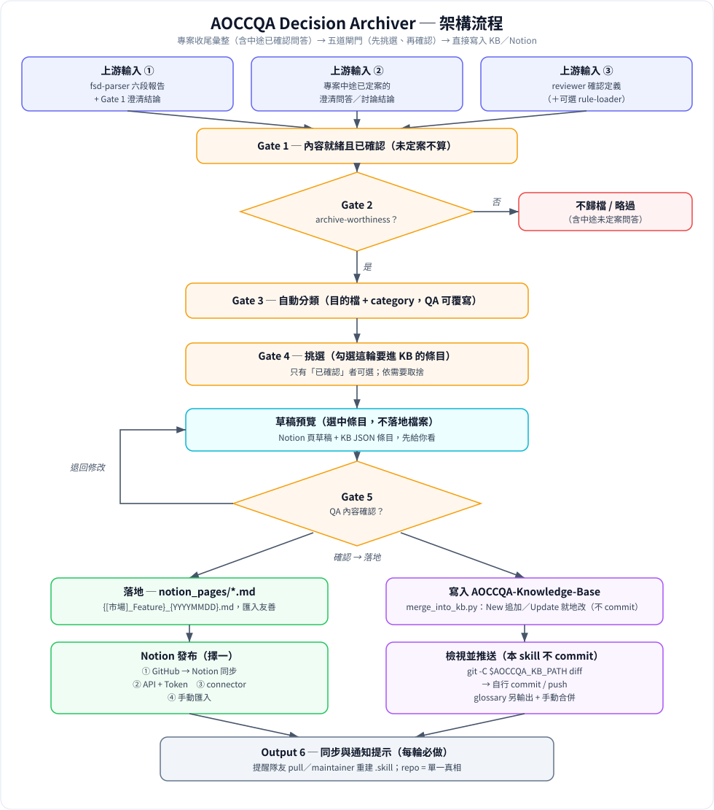

# AOCCQA Decision Archiver（知識歸檔決策員）

AOCCQA 測試案例產線的**終端歸檔 skill**。把一輪需求分析／審查中「已確認的功能定義與規則解釋」，
沉澱成未來 AI 可檢索的知識——不是流水帳，也不是測試案例清單。

## 這支 skill 做什麼

彙整上游已確認的素材（`aoccqa-fsd-parser` 六段報告 + Gate 1 澄清結論、
`aoccqa-quality-reviewer` 確認的行為定義、可選的 `aoccqa-rule-loader` Rule Context），
產出**兩條歸檔路徑**：

1. **Notion** — 人類可讀的功能定義頁（給 PM/RD/QA 看的功能定義知識庫），
   結構對齊 AOCC SW PJT 現行 Notion 頁面。
2. **AOCCQA_glossary + AOCCQA-Knowledge-Base** — 轉譯成兩支 repo 看得懂的 JSON 條目
   （`terms` / `relations` / `system_relations` / `ecpages` / `traceability` / `quicklookup`），
   **交你自行合併**進 repo（本 skill 不 commit）。

## 架構流程（Flow Chart）



## 核心規範

- **先預覽、確認後才落地**：Gate 4 分兩步且順序不可顛倒——(1) 先在對話中呈現細節摘要 + `.md`／JSON 草稿的大致預覽，此時**不寫任何檔案**；(2) 使用者確認內容後，才寫出最終成品檔。
- **分類自動、內容要確認**：歸到哪一功能／哪個檔由 Agent 自動指派（QA 可覆寫）；完整草稿內容一律經 QA 人工確認後才發布／輸出。
- **只歸檔已確認內容**：未確認、待釐清的一律不寫入知識庫。
- **不做**：重新解析 FSD（屬 fsd-parser）、產 Test Case/Steps（屬 tc-generator）、記錄 Keep/Cut 清單（屬 case-exporter）、直接 commit GitHub。

## 檔案結構

```
AOCCQA-decision-archiver/
├── SKILL.md                        # skill 進入點：職責、閘門、輸出契約
├── README.md                       # 本文件
├── .gitignore                      # 排除憑證檔、.claude/、notion_pages/ 成品
├── references/
│   ├── kb_schemas.md               # 目標 JSON schema、分類路由、必填欄位、category 列舉
│   ├── templates.md                # Notion 頁模板（Template A）+ 各檔 JSON 條目模板
│   ├── notion_setup.md             # Notion API + Token 設定；含零權限「手動匯入」備援
│   ├── example_add_to_cart.md      # 範例：對齊團隊 Notion 的功能定義頁
│   └── example_energy_label.md     # 範例：對齊團隊 Notion 的功能定義頁
├── scripts/
│   ├── validate_entries.py         # 合併前檢查：schema 齊全、id 不撞號、算下一個 id
│   └── notion_publish.py           # 用 Notion API + token 把 Markdown 草稿建成頁面
└── notion_pages/                   # ← 每輪工作產物（QA 確認後才生成，已 gitignore）
    └── {[市場]_Feature}_{YYYYMMDD}.md
```

> `notion_pages/` 與 `.claude/` 已列入 `.gitignore`：成品是每輪工作產物、非 skill 原始碼，不進 repo、不進 `.skill` 包。

## 產出檔位置

所有給使用者的 `.md` / JSON 成品，一律**在 QA 確認後**寫進本 skill 所在資料夾：

- Notion 匯入用的功能定義頁 `.md` → `AOCCQA-decision-archiver/notion_pages/`，
  檔名 `{[市場]_Feature}_{YYYYMMDD}.md`（Notion「Import → Markdown」可直接匯入）。
- **匯入友善**：產出的 `.md` 不含 HTML 註解 `<!-- -->`，否則 Notion 會當文字顯示。

## Notion 功能定義頁：結構與書寫原則

**結構**：一律用 `references/templates.md` 的 **Template A**，對齊 AOCC SW PJT 現行 Notion export——
`[市場] Feature` 標題 + 屬性（發案人／建立日期／標籤／FSD／Figma）、Purpose、顯示邏輯、
Magento 後台設定、多語系 UI Info 表、Anatomy 欄位對來源、前台呈現（依商品型態
Simple・Configurable・Customized Bundle・Related Products）、測試重點、來源。
完整範例見 `references/example_add_to_cart.md`、`references/example_energy_label.md`。

**篩選（先篩掉不需要的再呈現）**：以「新人 / QA / PM 需不需要理解」為準。
- 保留：功能在做什麼、核心決策邏輯（分支／條件）、觸發來源、商品型態、判定條件、
  導向／顯示結果與觀察點、回歸範圍、QA 可查的前後台驗證點、scope／國別／環境時程、
  正／負／邊界測試點、待釐清。
- 篩掉：Security / Infra check list（多為 N/A）、DB「無變更」、完整 code path、
  PR / deploy 內部、原始 mermaid 碼。

**完整性（fill completeness）**：交叉比對 FSD（Confluence）＋ 團隊已確認行為（Notion 現行頁 / reviewer 結論），
把「FSD 沒寫但團隊已確認」的行為補進來；仍無解者才留「待確認」，不臆造。

**書寫風格**：白話 + 實際情境套用（每條規則配一個具體例子）；專有名詞保留原文
（Buy Page、add-on、WEP、Cart page…不翻中文）；名詞解釋只放本次需求相關的新詞，置於文件最下方。

## 輸出契約（五段）

1. Archive Decision Summary（來源、archive-worthiness、自動分類、待確認）
2. Notion Draft（人類可讀頁草稿；**先在對話預覽**，確認後才寫成 `notion_pages/…md`）
3. Glossary/KB JSON Entries（逐檔 New/Update 條目 + 計數增量）
4. QA Confirmation Gate（待確認內容項；分類已填可覆寫）→ 確認後才落地檔案
5. Merge & Publish Instructions（Notion 發布方式 + repo 手動合併步驟）

## Notion 發布（QA 確認內容後，依序擇一）

1. **GitHub → Notion 同步**：把符合模板的 Markdown 放進 repo，由既有 GitHub→Notion 同步機制帶進 Notion。
2. **Notion 官方 API + Internal Integration Token**：用 `scripts/notion_publish.py` 建頁。
   首次依 `references/notion_setup.md` 建 integration、Connect 父頁/庫、取得父 ID；先 `--dry-run` 確認 payload 再正式送出。
3. **Notion connector**：若已授權，改用 Notion MCP 工具建頁。
4. **手動匯入（零權限備援）**：Notion 側邊欄 Import → Markdown & CSV 匯入 `.md`（表格最穩），或直接貼上。詳見 `references/notion_setup.md`。

> **Token 資安鐵則**：token 一律**不放本 skill 資料夾**（會同步 OneDrive、且產線 JSON 要合併進公開 GitHub repo）；
> 用環境變數 `NOTION_TOKEN` 或放在同步夾以外的 `--token-file`。細節見 `references/notion_setup.md`。

## 合併前檢查

```bash
python scripts/validate_entries.py --entries new_entries.json \
  --kb <aoccqa-knowledge-base>/references
```

檢查通過**不代表可合併**——仍須經 QA 內容確認（Gate 4）後，才手動合併進 repo／發布到 Notion。

## 知識庫維護 SOP（團隊照這個走）

> 完整規範（書寫 / 篩選 / 維護 / 同步通知）見 [`MAINTENANCE.md`](MAINTENANCE.md)。下方為摘要。


知識庫（`AOCCQA_glossary` / `AOCCQA-Knowledge-Base`）的更新**不會自動同步**給其他人。Git 是「拉」的：commit + push 只更新 repo，隊友要自己 `git pull`（或重裝更新過的 `.skill`）才會拿到。

要分清楚兩層：

- **GitHub repo** = 單一真相（source of truth）。
- **每個人本機安裝的 skill** = Claude 實際查的副本。**直接改本機快取無效**，且會被下次更新覆蓋——一律改在 repo。

維護流程（測一次、大家同步一次）：

1. **改**：`aoccqa-decision-archiver` 產出 JSON 條目 → `validate_entries.py` 驗過 → QA 開 branch → PR → review → merge 到 `main`。
2. **散**：隊友定期 `git pull main`；若知識庫以 `.skill` 安裝，由 maintainer 用 `AOCCQA_glossary` 的 `build_skill.sh` 重建 `.skill`，大家重裝一次。
3. **原則**：只有 maintainer 能 merge 到 `main`；個人不各自本機亂改。合併後同步兩支 repo（glossary 另更 `.md` 與兩邊 `kb_manifest.json` 計數）。

> 一句話：**repo = 共用真相，pull／重裝 = 每個人同步的動作，兩者分開想。**

## 相依

- `aoccqa-knowledge-base`：查重、抓現有 feature 名、算下一個 id（只查不載，Token 鐵則）。
- **Notion 發布**：預設走 GitHub→Notion 同步或官方 API + Internal Integration Token
  （`scripts/notion_publish.py`，見 `references/notion_setup.md`，免 connector 授權）；
  也可改用已授權的 Notion connector，或退回手動匯入／貼上。
